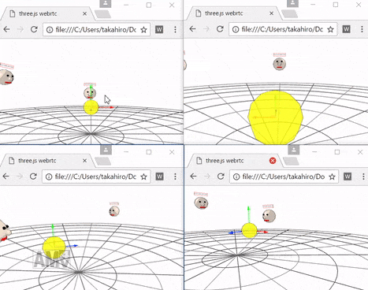
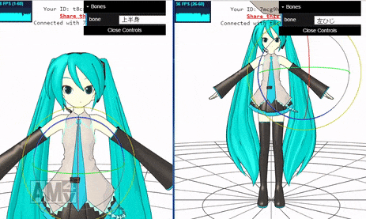

# ThreeNetwork

ThreeNetwork is real-time network library for Three.js. ThreeNetwork synchronizes Three.js objects with remote. It supports [PeerJS](http://peerjs.com/), [EasyRTC](https://easyrtc.com/), and [Firebase](https://firebase.google.com/)




## Demo

- [PeerJS](http://takahirox.github.io/ThreeNetworkDemo/peerjs.html)
- [PeerJS with Skinning edit](http://takahirox.github.io/ThreeNetworkDemo/peerjs_mmd.html)
- EasyRTC
- [Firebase](http://takahirox.github.io/ThreeNetworkDemo/firebase.html)
- [Firebase+WebRTC](http://takahirox.github.io/ThreeNetworkDemo/firebase2.html)
- [Firebase+WebRTC+Physics](http://takahirox.github.io/ThreeNetworkDemo/firebase2_physics.html)

## Features

- easy to setup and use
- multi-user with room system
- low latency with WebRTC
- efficient data transfer
- media streaming(audio, video) support

## Sample code

In your code, import `RemoteSync`

- js/networks/RemoteSync.js

and `NetworkClient` (and `SignalingServer`) depending on your platform.

- js/networks/FirebaseSignalingServer.js
- js/networks/WebRTCClient.js
- js/networks/PeerJSClient.js
- js/networks/EasyRTCClient.js
- js/networks/FirebaseClient.js

```javascript
<script src="https://rawgit.com/mrdoob/three.js/r85/build/three.js"></script>

<script src="js/networks/RemoteSync.js"></script>
<script src="js/networks/FirebaseSignalingServer.js"></script>
<script src="js/networks/WebRTCClient.js"></script>

var remoteSync, localId;

remoteSync = new THREE.RemoteSync(
  new THREE.WebRTCClient(
    new THREE.FirebaseSignalingServer( {
      authType: 'anonymous',
      apiKey: 'your-api',
      authDomain: 'your-project.firebaseapp.com',
      databaseURL: 'https://your-project.firebaseio.com'
    } )
  )
);

// when connects signaling server
remoteSync.addEventListener( 'open', function ( id ) {
  localId = id;
  var localMesh = new THREE.Mesh(...);
  remoteSync.addLocalObject( localMesh, { type: 'mesh' } );
  scene.add( localMesh );
  var sharedMesh = new THREE.Mesh(...);
  // local and remote peers must set the same unique shared id
  // to a object shared between them
  remoteSync.addSharedObject( sharedMesh, 'unique-shared-id' );
  scene.add( sharedMesh );
} );

// when remote adds an object
remoteSync.addEventListener( 'add', function ( remotePeerId, objectId, info ) {
  var remoteMesh;
  // make an object fitting to info sent from a remote peer
  switch( info.type ) {
    case 'mesh':
      remoteMesh = new THREE.Mesh(...);
      break;
    default:
      return;
  }
  scene.add( remoteMesh );
  remoteSync.addRemoteObject( remotePeerId, objectId, remoteMesh );
} );

// when remote removes an object
remoteSync.addEventListener( 'remove', function ( remotePeerId, objectId, object ) {
  if ( object.parent !== null ) object.parent.remove( object );
} );
  
// Joins a room
function connect( roomId ) {
  remoteSync.connect( roomId );
}
  
// sync and render
function render() {
  requestAnimationFrame( render );
  remoteSync.sync();
  renderer.render( scene, camera );
}
```

## Concept

ThreeNetwork regards Three.js objects as three type objects.

- Local object
- Remote object
- Shared object

Local object is a object registered to `RemoteSync` with `.addLocalObject()`. Local object status will be sent to remote peers. Local object addition will be notified to remote peers' `add` event listener.

Remote object is a object registered to `RemoteSync` with `.addRemoteObject()`. Remote object status will reflect the status of a corresponding remote peer's local object. ThreeNetwork requires local peer to add a Remote object when it's notified remote peer's Local object addition by a remote peer via `add` event listener. Notification comes with info of remote peer's Local object, local peer needs to create an appropriate object by seeing info and register is as a Remote object.

Shared object is a object registered to `RemoteSync` with `.addSharedObject()`. Shared object status will be sent to remote peers and also reflect the status of a corresponding remote peer's shared object. Shared object will be bind with remote peers objects assigned the same shared-id.

ThreeNetwork doesn't care objects which aren't registered to `RemoteSync`.

## Media streaming

ThreeNetwork supports media streaming (audio, video), but it just transfers streaming. You need to setup in your user code if you wanna make the use it, for example if you wanna play remote peer's video streaming on local. Refer to some documents for the setup.
- https://developer.mozilla.org/en/docs/Web/API/Navigator/getUserMedia
- https://www.html5rocks.com/en/tutorials/getusermedia/intro/

To transfer local streaming to remote, get local media stream with `navigator.*GetUserMedia()` and then pass it to `NetworkClient` as `.stream`.

```javascript
navigator.getUserMedia = navigator.getUserMedia ||
                         navigator.webkitGetUserMedia ||
                         navigator.mozGetUserMedia ||
                         navigator.msGetUserMedia;

navigator.getUserMedia( { audio: true },
  function ( stream ) {
    remoteSync = new THREE.RemoteSync(
      new THREE.WebRTCClient(
        new THREE.FirebaseSignalingServer( { ... } ),
        { stream: stream }
      )
    );  
  }
);
```

To receive remote peer's stream, set `remote_stream` event listener.

```javascript
remoteSync.addEventListener( 'remote_stream', functioin ( remoteStream ) {
  // setup audio context or something with remote stream here
} );
```

## Setup with servers

### PeerJS + PeerServer Cloud service

The easiest way is to use PeerServer Cloud service of PeerJS.

1. Go to [PeerServer Cloud service](http://peerjs.com/peerserver)
2. Get API key
3. Pass the API key to `PeerJSClient`.

```javascript
<script src="https://rawgit.com/mrdoob/three.js/r85/build/three.js"></script>
<script src="js/networks/RemoteSync.js"></script>
<script src="js/networks/PeerJSClient.js"></script>

remoteSync = new THREE.RemoteSync(
  new THREE.PeerJSClient( {
    key: 'your-api'
  } )
);
```

Note that PeerServer Cloud service has limitation.

- Up to 50 concurrent connections
- No room system, a peer can't know other remote peers connected to the server

Then you need to pass a remote peer's id you wanna connect to `.connect()`. (So, maybe the remote peer needs to share its id with you beforehand.)

```javascript
remoteSync.connect( 'remote-peer-id' );
```
If you wanna avoid these limitation, you need to run your own PeerServer.

### PeerJS + Your own PeerServer

1. Go to [peerjs-server GitHub](https://github.com/peers/peerjs-server)
2. Follow the instruction and run your own server
3. Set `allowDiscovery: true` of `PeerJSClient`, and pass `host`, `port`, `path` to it.

```javascript
<script src="https://rawgit.com/mrdoob/three.js/r85/build/three.js"></script>
<script src="js/networks/RemoteSync.js"></script>
<script src="js/networks/PeerJSClient.js"></script>

remoteSync = new THREE.RemoteSync(
  new THREE.PeerJSClient( {
    allowDiscovery: true,
    host: 'hostname',
    port: portnum,
    path: path
  } )
);
```

`PeerJSClient` acts as there's one room in the server then you don't need to pass id to `.connect()`.

```javascript
remoteSync.connect( '' );
```

### Firebase

Using Firebase is another easiest way. You can sync object via Realtime Database of Firebase. This isn't WebRTC approach then you can't transfer media streaming and latency would be higher than WebRTC. But perhaps you can sync with more many peers with good performance.

1. Go to [Firebase console](https://console.firebase.google.com/)
2. Open project
3. Setup Authentication and Realtime Database security rule
4. Pass Authentication type, your apikey, authDomain, databaseURL to `FirebaseClient`

```javascript
<script src="https://rawgit.com/mrdoob/three.js/r85/build/three.js"></script>
<script src="js/networks/RemoteSync.js"></script>
<script src="js/networks/FirebaseClient.js"></script>

remoteSync = new THREE.RemoteSync(
  new THREE.FirebaseClient( {
    authType: 'none',  // currently only 'none' or 'anonymous'
    apiKey: 'your-apikey',
    authDomain: 'your-project-id.firebaseapp.com',
    databaseURL: 'https://your-project-id.firebaseio.com'
  } )
);
```

`FirebaseClient` supports room system, then pass roomId to `.connect()` to join.

```javascript
remoteSync.connect( 'roomId' );
```

### Firebase + WebRTC

You can also use Firebase as signaling server and connect remote peers with WebRTC.

1. Setup Firebase project (See above)
2. Pass Authentication type, your apikey, authDomain, databaseURL to `FirebaseSignalingServer`
3. Pass FirebaseSignalingServer instance to `WebRTCClient`

```javascript
<script src="https://rawgit.com/mrdoob/three.js/r85/build/three.js"></script>
<script src="js/networks/RemoteSync.js"></script>
<script src="js/networks/FirebaseSignalingServer.js"></script>
<script src="js/networks/WebRTCClient.js"></script>

remoteSync = new THREE.RemoteSync(
  new THREE.WebRTCClient(
    new THREE.FirebaseSignalingServer( {
      authType: 'none',  // currently only 'none' or 'anonymous'
      apiKey: 'your-apikey',
      authDomain: 'your-project-id.firebaseapp.com',
      databaseURL: 'https://your-project-id.firebaseio.com'
    } )
  )
);
```

`FirebaseSignalingServer`+`WebRTCClient` supports room system, then pass roomId to `.connect()` to join.

```javascript
remoteSync.connect( 'roomId' );
```

### EasyRTC

T.B.D.

## API

`RemoteSync`
- `addLocalObject( object, info, recursive )`: Registers a Local object. Local object's status will be sent to remote by invoking `.sync()`. Local object addition with `info` will be notified to remote peers' `add` event listener. If recursive is true, recursively registers object's children.
- `addRemoteObject( remotePeerId, objectUuid, object )`: Registers a Remote object. Remote object's status reflect to a corresponding remote peer's local object. This method is assumed to be called in `add` event listener callback function. If a correnponding object's children in remote are recursively registered, registers recursively its children here too. In that case, assumes the same object tree structure between local and remote.
- `addSharedObject( object, sharedId, recursive )`: Registers a Shared object. Shared object's status will be sent to remote by invokind `.sync()` and aldo reglect corresponding remote peers' Shared object. Shared object will bind with remote peers' shared object assigned the same shared id. If recursive is true, recursively registers object's children.
- `removeLocalObject( object )`: Removes a Local object from `RemoteSync`. If it's children are recursively registered, also removes them. In that case, assumes object tree structure doesn't change since it's registered.
- `removeSharedObject( sharedId )`: Unbinds Shared object. If it's children are recursively registered, also removes them. In that case, assumes object tree structure doesn't change since it's registered.
- `sync( force, onlyLocal )`: Broadcasts registered Local and Shared objects' status to remote peers. The status only of the objects which are updated since last `.sync()` for the efficient data transfer. If `force` is true, the status of all objects will be sent even if they aren't updated. If `onlyLocal` is true, the status only of Local objects will be sent.
- `connect( id )`: Connects a room or a remote peer (depending on platform)
- `sendUserData( remotePeerId, data )`, `broadcastUserData( data )`: Sends/Broadcasts user-data to remote peer(s). These methods invoking will be notified to Remote peers' `receive_user_data`.
- `addEventListener`: Adds event listener. Requires three arguments ( `type`, `object`, `function` ) for `update`, two arguments ( `type`, `function` ) for others.
  - `open` ( peerId ): When connected with server.
  - `close` ( peerId ): When disconnected from server.
  - `error` ( errorMessage ): When error occurs.
  - `connect` ( remotePeerId, fromPeer ): When connected with a remote peer. `fromPeer` is a flag indicating if a remote peer sends connection request.
  - `disconnect` ( remotePeerId ): When disconnected from a remote peer.
  - `add` ( remotePeerId, objectUuid, info ): When a remote peer adds its local object. `.addRemoteObject()` is assumed to be called in this listener callback function.
  - `remove` ( remotePeerId, objectUuid, remoteObject ): When a remote peer removes its local object. An object automatically be removed from `RemoteSync`.
  - `update`: When a shared or remote object is updated by remote peer's `.sync()`.
  - `receive` (data): When receives data from a remote peer.
  - `remote_stream` (stream): When receives media streaming from a remote peer.
  - `receive_user_data` (data): When received user-data from a remote peer.
